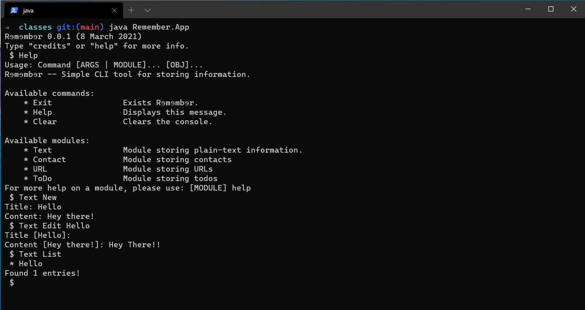

# Remember
CLI Application made in Java for saving:

 * Notes
 * Contacts
 * Urls
 * Checklists
 * Places to visit
 * Movies to watch
 * Money spent on stuff
 
## Usage

Remember can be used both as a standard CLI tool and as an interactive environment.

Please use `Remember Help` from the command line, or `Help` from CLI Interactive for a detailed list of instructions.

